# Merrimac Portfolio Analytics - Architecture Documentation

## Overview

This document provides a comprehensive technical overview of the Merrimac Portfolio Analytics Platform, including system architecture, security implementation, and data flow.

---

## 1. System Architecture - Complete Flow

```mermaid
graph LR
    subgraph DEV["💻 DEVELOPMENT"]
        A1["Python Code<br/>(app.py)<br/>5000+ lines"]
        A2["Dependencies<br/>(requirements.txt)<br/>11 packages"]
        A3["Assets<br/>(logo.jpg)"]
    end
    
    subgraph GIT["🐙 GITHUB REPOSITORY<br/>nthomason84/family-office-dashboard"]
        B1["✅ Public Files<br/>• app.py<br/>• requirements.txt<br/>• merrimac_logo.jpg"]
        B2["❌ Protected<br/>• secrets.toml<br/>• data/*.xlsx<br/>(via .gitignore)"]
    end
    
    subgraph CLOUD["☁️ STREAMLIT CLOUD"]
        C1["Auto-Deploy<br/>Monitors GitHub<br/>2-min updates"]
        C2["🔐 Secrets<br/>password='xxx'<br/>Encrypted"]
        C3["App Server<br/>Python Runtime<br/>HTTPS"]
    end
    
    subgraph AUTH["🔒 TWO-LAYER SECURITY"]
        D1["Layer 1<br/>📧 Email Auth<br/>Approved list"]
        D2["Layer 2<br/>🔑 Password<br/>from Secrets"]
    end
    
    subgraph APP["📊 APPLICATION"]
        E1["🦔 Hedge Funds<br/>Performance<br/>Risk<br/>Factors"]
        E2["🏢 Private Equity<br/>IRR/MOIC<br/>Vintage<br/>J-curve"]
        E3["🤖 AI Assistant<br/>ChatGPT<br/>Reports<br/>Insights"]
    end
    
    subgraph DATA["💾 DATA FLOW"]
        F1["User Uploads<br/>.xlsx file<br/>In-memory"]
        F2["Processing<br/>Pandas<br/>Analytics"]
        F3["Visualization<br/>Plotly Charts<br/>Interactive"]
        F4["Session Ends<br/>❌ No Storage<br/>Data Deleted"]
    end
    
    A1 -->|git push| B1
    A2 -->|git push| B1
    A3 -->|git push| B1
    
    B1 -->|webhook| C1
    C1 --> C3
    C2 -.->|runtime| C3
    
    C3 --> D1
    D1 -->|✅ pass| D2
    D2 -->|✅ pass| E1
    D2 -->|✅ pass| E2
    D2 -->|✅ pass| E3
    
    E1 --> F1
    E2 --> F1
    E3 --> F1
    
    F1 --> F2
    F2 --> F3
    F3 --> F4
    
    style DEV fill:#e3f2fd,stroke:#1976d2,stroke-width:3px
    style GIT fill:#fff9c4,stroke:#f57c00,stroke-width:3px
    style CLOUD fill:#f3e5f5,stroke:#7b1fa2,stroke-width:3px
    style AUTH fill:#ffcdd2,stroke:#c62828,stroke-width:3px
    style APP fill:#c8e6c9,stroke:#388e3c,stroke-width:3px
    style DATA fill:#b3e5fc,stroke:#0277bd,stroke-width:3px
    
    style B2 fill:#ffebee,stroke:#d32f2f,stroke-width:2px,stroke-dasharray: 5 5
    style C2 fill:#ffebee,stroke:#d32f2f,stroke-width:2px
    style F4 fill:#fff3e0,stroke:#f57c00,stroke-width:2px
```

**Key Components:**
- **Development:** Local Python development with version control
- **GitHub:** Code repository with automatic deployment triggers
- **Streamlit Cloud:** Managed hosting with encrypted secrets
- **Security:** Two-factor authentication (email + password)
- **Application:** Three analysis modules for different asset classes
- **Data Flow:** In-memory processing with zero persistence

---

## 2. Security Authentication Flow

**Security Layers:**
1. **Email Authentication:** Streamlit's built-in access control with approved email list
2. **Password Authentication:** Custom implementation using encrypted secrets
3. **Data Security:** Zero persistence - all data deleted after session ends

---

## 3. System Overview - High Level

```mermaid
graph TB
    subgraph TOP["🏢 MERRIMAC PORTFOLIO ANALYTICS PLATFORM"]
        direction LR
        T1["Two-Layer Security"]
        T2["Cloud-Based"]
        T3["Real-Time Analysis"]
        T4["No Data Storage"]
    end
    
    subgraph ROW1["TECHNOLOGY STACK"]
        direction LR
        A1["💻 Python<br/>5000+ lines<br/>11 packages"]
        A2["🐙 GitHub<br/>Version Control<br/>Auto-Deploy"]
        A3["☁️ Streamlit<br/>Cloud Hosting<br/>HTTPS"]
    end
    
    subgraph ROW2["SECURITY LAYERS"]
        direction LR
        B1["🔐 Layer 1<br/>Email Auth<br/>Approved List"]
        B2["🔐 Layer 2<br/>Password<br/>Encrypted Secret"]
        B3["✅ Result<br/>Dual Protection<br/>Audit Trail"]
    end
    
    subgraph ROW3["ANALYSIS MODULES"]
        direction LR
        C1["🦔 Hedge Funds<br/>Performance<br/>Risk & Factors<br/>Taleb Framework"]
        C2["🏢 Private Equity<br/>IRR/MOIC/DPI<br/>Vintage Analysis<br/>J-Curve"]
        C3["🤖 AI Assistant<br/>ChatGPT API<br/>Auto Reports<br/>Insights"]
    end
    
    subgraph ROW4["DATA SECURITY"]
        direction LR
        D1["📤 User Upload<br/>Excel files<br/>In-memory only"]
        D2["⚡ Processing<br/>Browser session<br/>No server save"]
        D3["🗑️ Auto-Delete<br/>Logout/Close<br/>Zero retention"]
    end
    
    TOP --> ROW1
    ROW1 --> ROW2
    ROW2 --> ROW3
    ROW3 --> ROW4
    
    style TOP fill:#1976d2,stroke:#0d47a1,stroke-width:4px,color:#fff
    style ROW1 fill:#e3f2fd,stroke:#1976d2,stroke-width:3px
    style ROW2 fill:#ffcdd2,stroke:#c62828,stroke-width:3px
    style ROW3 fill:#c8e6c9,stroke:#388e3c,stroke-width:3px
    style ROW4 fill:#fff3e0,stroke:#f57c00,stroke-width:3px
    
    style A1 fill:#bbdefb,stroke:#1976d2,stroke-width:2px
    style A2 fill:#bbdefb,stroke:#1976d2,stroke-width:2px
    style A3 fill:#bbdefb,stroke:#1976d2,stroke-width:2px
    
    style B1 fill:#ffcdd2,stroke:#c62828,stroke-width:2px
    style B2 fill:#ffcdd2,stroke:#c62828,stroke-width:2px
    style B3 fill:#a5d6a7,stroke:#388e3c,stroke-width:2px
    
    style C1 fill:#c8e6c9,stroke:#388e3c,stroke-width:2px
    style C2 fill:#c8e6c9,stroke:#388e3c,stroke-width:2px
    style C3 fill:#c8e6c9,stroke:#388e3c,stroke-width:2px
    
    style D1 fill:#ffe0b2,stroke:#f57c00,stroke-width:2px
    style D2 fill:#ffe0b2,stroke:#f57c00,stroke-width:2px
    style D3 fill:#ffe0b2,stroke:#f57c00,stroke-width:2px
```

**Platform Highlights:**
- **Technology:** Python-based with 11 specialized packages
- **Deployment:** Continuous deployment from GitHub to Streamlit Cloud
- **Security:** Dual-layer authentication with audit capabilities
- **Features:** Hedge funds, private equity, and AI-powered analysis
- **Privacy:** Zero data retention policy

---

## Technical Specifications

### Python Packages
- **Framework:** streamlit 1.50.0
- **Data Processing:** pandas, numpy
- **Visualization:** plotly
- **Financial Data:** yfinance, numpy-financial
- **Analytics:** scipy, statsmodels
- **AI Integration:** openai
- **File Handling:** openpyxl, Pillow

### Security Features
- HTTPS encryption for all connections
- Email-based access control
- Encrypted password storage in Streamlit Secrets
- No data persistence (in-memory only)
- Automatic session cleanup
- Audit trail via email authentication

### Deployment
- **Platform:** Streamlit Cloud (Community)
- **Repository:** GitHub (public code, private data)
- **Auto-Deploy:** Triggered on git push to main branch
- **Update Time:** ~2 minutes from code commit to live update

---

## Data Privacy & Compliance

### Data Handling Policy
1. **No Storage:** All data processing happens in browser memory
2. **Session-Based:** Data exists only during active user session
3. **Auto-Cleanup:** All data automatically deleted on logout/close
4. **User Control:** Each user uploads and analyzes their own data
5. **Zero Logs:** No data is logged or saved on servers

### Access Control
- Approved email list maintained by administrator
- Password shared only with authorized users
- Both credentials required for access
- Email authentication provides audit trail

---

## Maintenance & Updates

### Updating the Application
1. Edit `app.py` locally or on GitHub
2. Commit changes to repository
3. Push to `main` branch
4. Streamlit Cloud auto-deploys within 2 minutes
5. No manual server management required

### Adding New Users
1. Go to Streamlit Cloud → App Settings
2. Navigate to Sharing settings
3. Add email address to approved list
4. Share app URL and password separately

### Changing Password
1. Go to Streamlit Cloud → App Settings → Secrets
2. Update password value
3. Save changes
4. Inform authorized users of new password

---

## Support & Documentation

- **Repository:** https://github.com/nthomason84/family-office-dashboard
- **Platform:** Streamlit Cloud
- **Framework Docs:** https://docs.streamlit.io
- **Mermaid Docs:** https://mermaid.js.org

---

*Last Updated: 2025*
